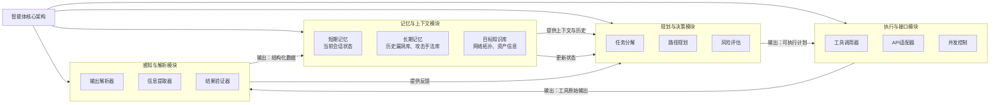

#### 1. 核心架构设计

一个智能化的安全测试系统通常由以下几个核心模块组成：

*   **规划模块:**
    *   负责理解测试目标、定义测试范围，并制定测试策略。
    *   它将宏大的测试目标分解为可执行的子任务（例如：信息收集 -> 端口扫描 -> 漏洞识别）。
    *   **关键功能：** 任务分解、路径规划、风险评估。

*   **执行模块:**
    *   负责调用具体的工具来执行规划模块产生的子任务。
    *   这是智能体与外部环境交互的“手”。
    *   **关键功能：** 命令行执行、API调用、并发控制。

*   **记忆与上下文:**
    *   存储测试过程中的所有数据，包括网络拓扑、已发现的漏洞、工具的输出结果等。
    *   **短期记忆：** 当前会话的上下文。
    *   **长期记忆：** 历史漏洞库、攻击手法库（TTPs）、目标系统的历史数据。

*   **感知与解析:**
    *   负责将工具输出的原始数据（如Nmap的XML、Burp的HTTP日志）转化为结构化、语义化的信息，供大模型（LLM）理解。
    *   **关键功能：** 日志解析、正则提取、关键信息过滤。

*   **反思与决策:**
    *   基于感知模块的反馈，评估当前动作的结果。
    *   如果一个测试步骤失败了，决定是重试、更换工具还是放弃该路径。
    *   **关键功能：** 逻辑判断、异常处理、下一步动作推理。

#### 2. 所需工具集

为了构建一个功能完备的安全测试智能体，需要集成不同类别的合规安全工具。这些工具必须是业内公认的、用于安全审计的标准工具。

##### A. 信息收集与侦察
*   **网络扫描工具:**
    *   **Nmap:** 用于端口发现、服务版本检测和操作系统指纹识别。这是基础的工具，用于绘制目标网络画像。
    *   **Masscan:** 用于在大范围内进行高速端口发现。
*   **资产枚举工具:**
    *   **Amass / Subfinder:** 用于子域名枚举，发现目标的攻击面（仅限于授权范围）。
    *   **DNSRecon:** 用于DNS记录收集。

##### B. 漏洞扫描与发现
*   **Web应用扫描器:**
    *   **OWASP ZAP / Burp Suite:** 用于代理流量、爬取网站结构，并自动检测常见的Web漏洞（如SQL注入、XSS）。
*   **漏洞扫描引擎:**
    *   **Nessus / OpenVAS:** 用于进行基于签名的系统级漏洞扫描，识别已知的CVE漏洞。
    *   **Nuclei:** 基于模板的快速漏洞扫描器，社区维护了大量无害的探测模板。

##### C. 漏洞验证与利用
*   **漏洞利用框架:**
    *   **Metasploit Framework:** 安全研究人员使用最广泛的框架，用于**验证**漏洞的存在性。在授权测试中，它用于证明漏洞的可利用性，而非进行破坏。
*   **模糊测试工具:**
    *   **AFL / LibFuzzer / Peach:** 用于向软件输入异常数据，以发现潜在的崩溃或缓冲区溢出漏洞。

##### D. 协议分析与网络操作
*   **网络协议操作:**
    *   **Scapy (Python库):** 允许智能体自定义和发送网络数据包，用于测试非标准协议或进行特定的网络连通性测试。
    *   **Curl / Wget:** 用于简单的HTTP交互测试。
*   **流量分析:**
    *   **Tcpdump / Wireshark (tshark):** 用于捕获和分析网络流量，验证数据传输的加密情况或异常行为。

#### 3. 详细工作流程

该智能体的运作并非简单的线性流程，而是一个循环迭代的闭环。

**阶段 1：初始化与侦察**
1.  **输入：** 用户输入目标IP地址或域名，并明确授权范围。
2.  **规划：** 智能体规划首先进行存活主机发现。
3.  **执行：** 调用 `Nmap` 进行Ping扫描。
4.  **感知：** 解析Nmap输出，提取存活IP列表。
5.  **记忆更新：** 将存活IP存入上下文。

**阶段 2：服务识别**
1.  **规划：** 针对存活的IP，规划端口和服务版本扫描。
2.  **执行：** 调用 `Nmap -sV`。
3.  **感知：** 识别开放端口（如80, 443, 22）及其对应的服务版本（如Apache 2.4.41）。
4.  **反思：** 发现Web服务（80/443端口），决定下一阶段转向Web扫描。

**阶段 3：漏洞发现**
1.  **规划：** 针对Web服务，调用Web扫描器；针对特定服务版本，查询CVE数据库。
2.  **执行：**
    *   调用 `Nuclei` 扫描常见Web漏洞。
    *   调用 `Searchsploit` 或本地数据库查询该Apache版本是否存在已知漏洞。
3.  **感知：** 汇总扫描结果，例如发现“目标存在SQL注入漏洞”或“存在CVE-2021-XXXX”。

**阶段 4：验证与报告**
1.  **规划：** 对发现的潜在高风险漏洞进行验证。
2.  **执行：** 使用 `Metasploit` 中的检查模块 或 `Curl` 发送特定的Payload（在不造成破坏的前提下）。
3.  **感知：** 确认漏洞是否真实存在。
4.  **输出：** 生成包含证据截图、风险等级和修复建议的安全测试报告。

### Tool Kits 
你正在规划一个功能完备的自动化安全测试智能体，这是一个在**授权范围内**评估和提升系统安全性的强大工具。我为你梳理了构建这样一个智能体所需的核心工具集，并按照其在智能体工作流中的主要功能进行了分类。

### 🧠 网络安全智能体工具全景图

以下表格详细列出了构建一个网络安全智能体所需的关键工具，它们覆盖了从信息收集到报告生成的全流程。

| 工具名称 | 主要功能 | 适用阶段 | 开源/商业 | 核心特点与智能体应用场景 |
| :--- | :--- | :--- | :--- | :--- |
| **信息收集与侦察** | | | | |
| **Nmap** | 网络发现、端口扫描、服务版本探测、操作系统指纹识别【turn0search0】【turn0search8】 | **信息收集** | 开源 | **网络地图绘制**：智能体使用Nmap进行存活主机发现、端口扫描和服务识别，是构建目标网络画像的基础工具【turn0search0】【turn0search8】。 |
| **Whois / Dig** | 域名注册信息查询、DNS记录枚举【turn0search21】 | **信息收集** | 开源 | **资产关联分析**：智能体通过Whois查询域名注册人信息，使用Dig进行DNS记录挖掘，帮助发现潜在的子域名和关联资产。 |
| **Maltego** | 开源情报（OSINT）收集、数据挖掘、关联分析，以可视化图谱形式展示关系【turn0search24】【turn0search28】 | **信息收集** | 社区版免费/商业版收费 | **人机关系图谱**：强大的数据挖掘和可视化工具，智能体可用其发现目标与人员、公司、域名、网络基础设施之间的隐藏关联，为攻击路径规划提供线索。 |
| **漏洞扫描与发现** | | | | |
| **Nessus** | 系统漏洞扫描，发现已知CVE，提供详细报告和修复建议【turn0search2】【turn0search4】 | **漏洞发现** | 商业（有免费版） | **广泛漏洞覆盖**：知名的商业漏洞扫描器，智能体可用其进行全面的系统漏洞评估，快速识别已知弱点【turn0search2】【turn0search4】。 |
| **OpenVAS** | 开源漏洞扫描和管理解决方案，功能类似Nessus【turn0search4】 | **漏洞发现** | 开源 | **开源替代方案**：作为Nessus的开源替代品，提供全面的漏洞扫描能力，智能体可在受限环境下使用。 |
| **Nuclei** | 基于模板的快速、定制化漏洞扫描器，社区维护了大量无害的探测模板【turn0search1】 | **漏洞发现** | 开源 | **敏捷扫描与定制**：智能体利用Nuclei的模板系统进行高效、针对性的扫描，并能轻松集成自定义检测逻辑，非常适合自动化。 |
| **Web应用测试** | | | | |
| **Burp Suite** | 集成化的Web应用程序安全测试平台，包含代理、抓包、扫描、入侵者等模块【turn0search0】【turn0search42】 | **Web漏洞发现与利用** | 商业（有免费社区版） | **Web渗透核心**：智能体使用Burp Suite的代理功能拦截和分析HTTP/HTTPS流量，使用Scanner进行自动化漏洞扫描，是Web安全测试的核心工具。 |
| **OWASP ZAP** | 免费的开源Web应用安全扫描器，适合初学者和自动化测试【turn0search0】【turn0search4】 | **Web漏洞发现** | 开源 | **易用的自动化扫描**：作为Zed Attack Proxy，它提供了强大的自动化扫描功能，智能体可用其发现常见的Web漏洞，如SQL注入、XSS等。 |
| **SQLMap** | 自动化SQL注入检测和利用工具，支持多种数据库【turn0search4】【turn0search8】 | **Web漏洞利用** | 开源 | **SQL注入专家**：智能体调用SQLMap自动化测试和利用SQL注入漏洞，接管数据库服务器，是针对特定漏洞的专用利器。 |
| **漏洞利用与后渗透** | | | | |
| **Metasploit Framework** | 渗透测试框架，提供大量漏洞利用模块、Payload和后渗透工具【turn0search1】【turn0search3】【turn0search4】 | **漏洞利用、后渗透、权限提升** | 开源 | **利用与扩展**：智能体的“武器库”。用于验证漏洞、生成Payload、在获取初步访问后进行权限提升、横向移动和持久化【turn0search1】【turn0search3】。 |
| **Cobalt Strike** | 商业红队框架，提供团队协作、丰富的C2通道和Malleable C2配置文件【turn0search42】 | **后渗透、团队协作、C2** | 商业 | **高级红队操作**：强大的C2框架，适合团队协作。智能体（或操作员）用它管理多个目标、模拟APT行为、进行长期潜伏。**注意：OSCP考试等场景受限**【turn0search17】。 |
| **Sliver** | 开源跨平台C2框架，支持多协议通信、动态代码生成和多人协作【turn0search40】【turn0search41】【turn0search49】 | **后渗透、C2** | 开源 | **现代开源C2**：作为Cobalt Strike的开源替代品，功能强大且免杀能力较强，智能体可用其建立稳定的C2通道，进行后渗透操作。**被APT和勒索软件团伙滥用**【turn0search40】【turn0search41】【turn0search46】。 |
| **密码攻击** | | | | |
| **John the Ripper** | 快速密码破解工具，支持多种哈希算法【turn0search8】【turn0search22】【turn0search23】 | **密码破解（离线）** | 开源 | **离线哈希破解**：智能体使用John对获取到的系统哈希值（如/etc/shadow）进行字典攻击或混合破解，尝试恢复明文密码。 |
| **Hashcat** | 自称“世界最快、最先进的密码恢复实用程序”，支持GPU加速【turn0search8】 | **密码破解（离线）** | 开源 | **高性能GPU破解**：在处理复杂密码哈希时，智能体可调用Hashcat利用GPU进行暴力破解或规则攻击，效率远超CPU。 |
| **Hydra** | 在线密码破解工具，支持多种协议（SSH, FTP, HTTP等）【turn0search8】【turn0search22】 | **密码破解（在线）** | 开源 | **在线服务爆破**：智能体使用Hydra对网络服务（如SSH、FTP登录表单）进行在线暴力破解或字典攻击，测试弱口令。 |
| **网络与流量分析** | | | | |
| **Wireshark** | 网络协议分析器，实时捕获和深度检查网络数据包【turn0search1】【turn0search8】 | **流量分析、协议理解** | 开源 | **流量显微镜**：智能体使用Wireshark捕获和分析网络流量，排查网络问题，分析攻击流量，验证加密效果。 |
| **tcpdump** | 命令行网络数据包捕获和分析工具【turn0search22】 | **流量捕获** | 开源 | **轻量级抓包**：在资源受限或需要自动化脚本调用的场景下，智能体使用tcpdump进行高效的数据包捕获和过滤。 |
| **Scapy** | 强大的Python数据包处理库，可用于网络发现、数据包制作和协议测试【turn0search1】 | **自定义网络操作** | 开源 | **数据包 crafting king**：智能体（尤其是Python实现的）使用Scapy自定义和发送任意网络数据包，进行非常规的协议测试、漏洞利用或网络欺骗。 |
| **实用工具与辅助** | | | | |
| **Netcat / Socat** | 网络工具“瑞士军刀”，用于端口扫描、端口转发、文件传输、建立反弹/正向Shell等【turn0search12】 | **通用网络操作、Shell获取** | 开源 | **网络管道工**：智能体使用Netcat/Socat在目标上建立简单的后门、传输文件、设置端口跳板，是连接各环节的“胶水”。 |
| **PowerShell / Powercat** | Windows系统强大的命令行和脚本环境，Powercat是PowerShell版的Netcat【turn0search12】 | **Windows环境操作、横向移动** | 内置于Windows | **Windows原生利用**：智能体在Windows目标上使用PowerShell进行信息收集、执行命令、下载执行Payload。Powercat用于在Windows上建立网络连接和Shell。 |
| **Curl / Wget** | 命令行工具，用于发送HTTP请求和下载文件【turn0search10】 | **文件下载、Web交互** | 开源 | **简单HTTP客户端**：智能体使用Curl或Wget从远程服务器下载恶意文件或工具，或与Web服务进行简单交互。 |
| **报告生成与协作** | | | | |
| **Dradis** | 协作报告平台，整合测试数据，生成标准化报告。 | **报告生成、团队协作** | 开源/商业 | **协作与报告中心**：智能体将所有测试结果（扫描、漏洞、截图）导入Dradis，自动生成结构化的渗透测试报告，极大提升报告编写效率。 |
| **MITRE ATT&CK** | 并非单一工具，而是**知识库和框架**，描述了对手的战术和技术。 | **攻击行为映射、防御评估** | 开源知识库 | **行为翻译官**：智能体将发现的漏洞和利用手段映射到ATT&CK框架（如T1134令牌操作【turn0search36】），使测试结果标准化，便于与防御团队沟通和评估安全控制有效性。 |

---

### ⚙️ 智能体核心架构与工具集成

拥有工具库只是第一步，智能体还需要一个**大脑**和**神经系统**来协调它们的工作。其核心架构通常包含以下模块：

#### 🔧 模块详解与工具集成方式

1.  **规划与决策模块**
    *   **功能**：理解高层目标（如“获取内网域控权限”），将其分解为一系列子任务（如“扫描内网”、“寻找漏洞”、“利用漏洞”、“横向移动”），并根据当前状态和反馈动态调整计划。
    *   **实现基础**：通常基于**规则引擎**、**状态机**或**强化学习**算法。对于初阶智能体，**预定义的攻击链模板**（如基于MITRE ATT&CK框架的流程）结合**条件判断**是常见选择。
    *   **与工具集成**：此模块**不直接调用工具**，而是生成工具调用的“意图”或“指令”，交给执行模块处理。

2.  **执行与接口模块**
    *   **功能**：是智能体的“手”，负责安全、可靠地调用实际的安全工具。
    *   **实现基础**：一套**统一的工具接口抽象层**。为每类工具（扫描器、利用框架等）定义标准化的输入（如目标IP、端口、漏洞ID）和输出（如JSON、XML）格式。
    *   **与工具集成**：
        *   **命令行工具 (CLI)**：通过Python的`subprocess`模块或类似库调用，并捕获其标准输出和错误输出。
        *   **API调用**：对于提供REST API的工具（如部分商业漏洞扫描器），使用`requests`等库进行HTTP请求。
        *   **Python库**：对于像`Scapy`这样的Python库，直接作为模块导入调用。
        *   **并发控制**：使用线程池、进程池或异步IO（如`asyncio`）来并行执行多个工具，提高效率。

3.  **记忆与上下文模块**
    *   **功能**：是智能体的“大脑”，存储所有信息，避免重复工作，并支撑复杂决策。
    *   **实现基础**：
        *   **短期记忆**：使用**内存中的数据结构**（如字典、列表）或轻量级**图数据库**（如Neo4j）存储当前会话的动态信息。
        *   **长期记忆**：使用**文件系统**（JSON/YAML文件）、**SQLite/MySQL**数据库或**专业知识库**（如基于Elasticsearch）存储历史漏洞、攻击手法、目标网络知识等。
    *   **与工具集成**：此模块是**被动的数据提供者**。执行模块调用工具后，感知解析模块将结果存入记忆；规划模块从记忆中读取信息以做出决策。

4.  **感知与解析模块**
    *   **功能**：是智能体的“眼睛”和“耳朵”，负责理解工具输出的原始数据，并将其转化为结构化、语义化的信息，供其他模块使用。
    *   **实现基础**：大量使用**正则表达式**、**字符串解析**和**XML/JSON解析**库。对于复杂输出，可能需要**自然语言处理（NLP）** 技术。
    *   **与工具集成**：此模块**紧耦合**于具体工具。需要为每个工具的输出编写专门的**解析器（Parser）**，提取关键信息（如IP地址、开放端口、漏洞标题、CVE编号、漏洞证明截图路径）。

---

### 🚀 构建建议与最佳实践

1.  **从简单开始，逐步迭代**：不要试图一次性构建一个全能的智能体。先实现一个**线性执行工具链**的脚本，例如：`Nmap扫描 → 服务识别 → 漏洞扫描 → 生成报告`。然后再逐步加入决策、记忆和反馈循环。

2.  **拥抱开源，善用社区**：**Kali Linux**【turn0search21】【turn0search26】、**BlackArch**等渗透测试发行版已预装了上述绝大多数工具，是理想的运行环境。关注**Github**上的开源项目（如`OSCP-Automation`【turn0search18】），学习其架构和实现方式。

3.  **标准化输出，优先使用JSON**：在设计工具接口和解析器时，**优先选择输出JSON格式的工具**，或编写解析器将文本输出转换为JSON。JSON易于机器处理，是不同模块间数据交换的理想格式。

4.  **可视化攻击链**：将智能体的执行过程和发现的漏洞**映射到MITRE ATT&CK框架**上【turn0search31】【turn0search32】【turn0search33】。这不仅能让测试结果更专业、易懂，也能帮助你发现防御盲点，评估安全控制的有效性。

5.  **报告是最终交付物**：再强大的智能体，如果不能产出**清晰、专业、可操作的报告**，其价值也会大打折扣。投资于报告生成模块，确保它包含：
    *   **执行摘要**：为管理层准备的概览。
    *   **详细技术发现**：每个漏洞的描述、证据、风险评级和修复建议。
    *   **攻击路径可视化**：用图表展示是如何从初始访问到达高价值目标的。
    *   **附录**：所有的工具输出、截图、脚本等。
