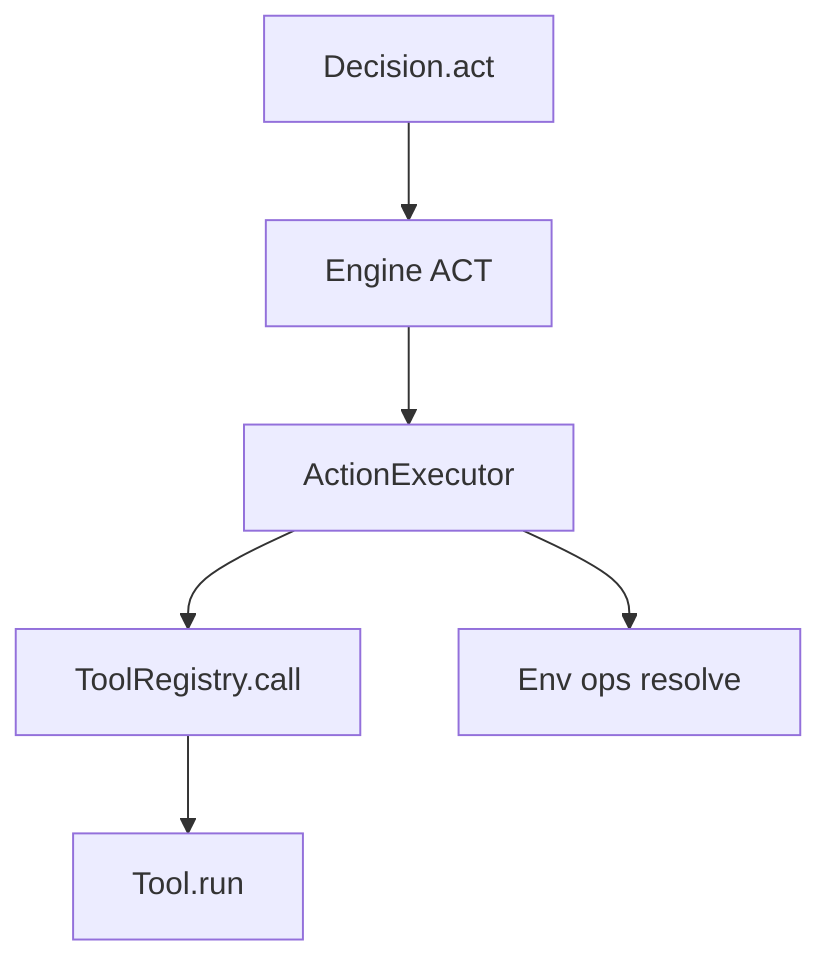

# Tools & ToolRegistry

## Goal

Learn how QitOS represents tools and dispatches them during `ACT`.

## Tool registration

Tools are registered via `ToolRegistry`.

You can register:

1. function tools
2. class-based tools
3. tool sets (a bundle of tools)

## Function tool (recommended)

Use `@tool` to attach the tool name without changing function semantics. In QiTOS,
the **callable docstring** is the canonical source of the tool description shown
to the model, so it should be written in a structured, agent-facing way.

```python
from qitos import ToolRegistry, tool

@tool(name="add")
def add(a: int, b: int) -> int:
    """
    Return the sum of two integers.

    :param a: First integer.
    :param b: Second integer.
    """
    return a + b

registry = ToolRegistry().register(add)
```

## Class-based tool

If you need configuration (workspace root, credentials, caches), wrap methods on a class and use `ToolRegistry.include(...)`.

```python
from qitos import ToolRegistry, tool

class FileTools:
    def __init__(self, workspace_root: str = "."):
        self.workspace_root = workspace_root

    @tool(name="create")
    def create(self, path: str, file_text: str = "") -> dict:
        """
        Create a new file with the given content.

        :param path: Path relative to the workspace root (e.g., `notes/todo.md`).
        :param file_text: Content to write to the new file.

        Automatically creates parent directories if they don't exist.
        """
        ...

registry = ToolRegistry().include(FileTools())
```

## Tool Docstring Contract

QiTOS uses the callable docstring as the tool description that is exposed to the
agent. For shipped tools and user-defined tools, follow this exact style:

1. First line: one-sentence action summary.
2. One `:param ...:` line per argument the model should understand.
3. Short behavioral note at the end when needed.

Recommended template:

```python
@tool(name="create")
def create(path: str, file_text: str = "") -> dict:
    """
    Create a new file with the given content.

    :param path: Path relative to the workspace root (e.g., `new_file.py`).
    :param file_text: Content to write to the new file.

    Automatically creates parent directories if they don't exist.
    """
```

For `BaseTool` subclasses, QiTOS reads the `run(...)` docstring first and falls
back to the class docstring only if the method docstring is missing.

## Tool sets (bundle + lifecycle)

When a bundle needs setup/teardown or namespaces, use ToolSet and `register_toolset(...)`.

```python
from typing import Any
from qitos import ToolRegistry, tool

class MyToolSet:
    name = "myset"
    version = "1"

    def setup(self, context: dict[str, Any]) -> None:
        pass

    def teardown(self, context: dict[str, Any]) -> None:
        pass

    def tools(self):
        @tool(name="ping")
        def ping() -> str:
            return "pong"
        return [ping]

registry = ToolRegistry().register_toolset(MyToolSet(), namespace="util")
# tool name becomes: util.ping
```

## Env/ops injection (advanced, but important)

Tools can declare required ops groups (e.g. `file`, `process`, `web`). During execution, Engine resolves those ops from the selected `Env`
and passes them through `runtime_context` and optional injected parameters:

- `runtime_context`: always available if your tool accepts it
- `env`: injected when your tool signature includes `env`
- `ops`: injected when your tool signature includes `ops`
- `file_ops` / `process_ops`: injected when your tool signature includes them

That is how the same “tool semantics” can run on different backends (host/docker/remote) as long as the Env supports the required ops groups.

## Tool execution path



## Predefined Tool Packages (`qitos.kit.tool`)

Use these as off-the-shelf components, similar to using `torch.nn` blocks.

- Canonical coding bundle:
  - `CodingToolSet` (`view`, `create`, `str_replace`, `insert`, `search`, `list_tree`, `replace_lines`, `read_file`, `write_file`, `list_files`, `run_command`)
- EPUB bundle:
  - `EpubToolSet` (`list_chapters`, `read_chapter`, `search`)
- HTTP/Web tools:
  - `HTTPRequest`, `HTTPGet`, `HTTPPost`, `HTMLExtractText`
- Text-browser tools:
  - `WebSearch`, `VisitURL`, `PageDown`, `PageUp`, `FindInPage`, `FindNext`, `ArchiveSearch`
- Thinking toolset:
  - `ThinkingToolSet`, `ThoughtData`
- Tool libraries:
  - `InMemoryToolLibrary`, `ToolArtifact`, `BaseToolLibrary`
- Registry builders:
  - `math_tools()`, `editor_tools(workspace_root)`
  - `security_audit_tools(workspace_root, include_external=False)`
- Security audit preset:
  - `SecurityAuditToolSet`
  - `SECURITY_AUDIT_SYSTEM_PROMPT`
  - focused example: `examples/real/code_security_audit_agent.py`

Import pattern:

```python
from qitos.kit.tool import CodingToolSet, HTTPGet, ThinkingToolSet
```

## Source Index

- [qitos/core/tool.py](https://github.com/Qitor/qitos/blob/main/qitos/core/tool.py)
- [qitos/core/tool_registry.py](https://github.com/Qitor/qitos/blob/main/qitos/core/tool_registry.py)
- [qitos/engine/action_executor.py](https://github.com/Qitor/qitos/blob/main/qitos/engine/action_executor.py)
- [qitos/kit/tool/toolset.py](https://github.com/Qitor/qitos/blob/main/qitos/kit/tool/toolset.py)
- [qitos/kit/tool/__init__.py](https://github.com/Qitor/qitos/blob/main/qitos/kit/tool/__init__.py)
- [qitos/kit/planning/__init__.py](https://github.com/Qitor/qitos/blob/main/qitos/kit/planning/__init__.py)
