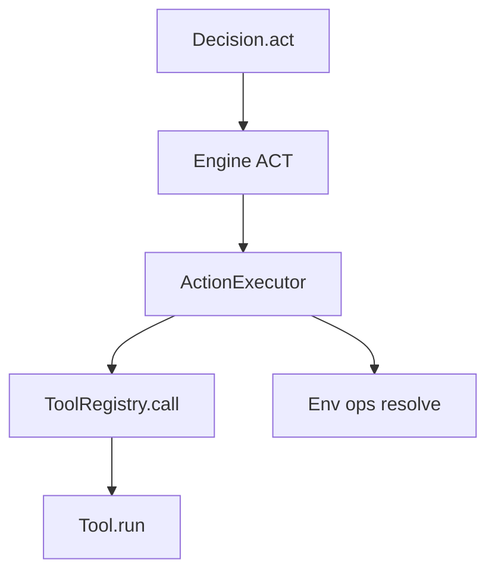

# Tool 与 ToolRegistry

## 目标

理解工具注册与执行路径（ACT 阶段）。

## 工具注册

通过 `ToolRegistry` 注册工具，可以注册：

1. 函数工具
2. 类工具
3. ToolSet（工具集合）

## 函数工具（推荐）

用 `@tool` 给函数挂上工具名，但不改变函数本身的调用语义。在 QiTOS 中，
**真正暴露给模型的工具描述，来自这个可调用对象自身的 docstring**，所以
docstring 必须按统一、面向 Agent 的方式来写。

```python
from qitos import ToolRegistry, tool

@tool(name="add")
def add(a: int, b: int) -> int:
    """
    Return the sum of two integers.

    :param a: First integer.
    :param b: Second integer.
    """
    return a + b

registry = ToolRegistry().register(add)
```

## 类工具（需要配置时用）

如果你的工具需要配置（workspace_root、缓存、凭证、client 等），用类把多个工具方法包起来，再用 `ToolRegistry.include(...)` 扫描并注册。

```python
from qitos import ToolRegistry, tool

class FileTools:
    def __init__(self, workspace_root: str = "."):
        self.workspace_root = workspace_root

    @tool(name="create")
    def create(self, path: str, file_text: str = "") -> dict:
        """
        Create a new file with the given content.

        :param path: 相对 workspace 根目录的路径（例如 `notes/todo.md`）。
        :param file_text: 要写入文件的内容。

        Automatically creates parent directories if they don't exist.
        """
        ...

registry = ToolRegistry().include(FileTools())
```

## Tool Docstring 规范

QiTOS 会直接把可调用对象的 docstring 当作工具描述暴露给模型。因此，无论是
框架内置工具还是你自己写的工具，都建议严格遵循下面的格式：

1. 第一行：一句话说明工具做什么。
2. 每个参数都写一行 `:param ...:`。
3. 结尾补一句简短说明，描述副作用、边界或使用建议。

推荐模板：

```python
@tool(name="create")
def create(path: str, file_text: str = "") -> dict:
    """
    Create a new file with the given content.

    :param path: Path relative to the workspace root (e.g., `new_file.py`).
    :param file_text: Content to write to the new file.

    Automatically creates parent directories if they don't exist.
    """
```

对于 `BaseTool` 子类，QiTOS 会优先读取 `run(...)` 的 docstring；如果
`run(...)` 没写，才会回退到类 docstring。

## ToolSet（bundle + 生命周期）

当一组工具需要 setup/teardown，或者希望统一 namespace 前缀时，用 ToolSet + `register_toolset(...)`。

```python
from typing import Any
from qitos import ToolRegistry, tool

class MyToolSet:
    name = "myset"
    version = "1"

    def setup(self, context: dict[str, Any]) -> None:
        pass

    def teardown(self, context: dict[str, Any]) -> None:
        pass

    def tools(self):
        @tool(name="ping")
        def ping() -> str:
            return "pong"
        return [ping]

registry = ToolRegistry().register_toolset(MyToolSet(), namespace="util")
# 工具名会变成：util.ping
```

## Env/ops 注入（高级但非常关键）

工具可以声明需要的 ops groups（例如 `file`、`process`、`web`）。执行时 Engine 会从你选定的 `Env` 解析这些 ops，
并通过 `runtime_context` 以及可选的“形参注入”方式传入：

- `runtime_context`：只要你的工具形参里有 `runtime_context` 就能拿到
- `env`：工具形参里有 `env` 时会自动注入
- `ops`：工具形参里有 `ops` 时会自动注入
- `file_ops` / `process_ops`：工具形参里有它们时会自动注入

这就是为什么“同一个工具语义”可以跑在 host/docker/remote 等不同后端，只要对应 Env 支持这些 ops groups。

## 工具执行路径



## 预定义工具包（`qitos.kit.tool`）

这些组件可以直接组合使用，类似 `torch.nn` 的现成模块。

- Canonical coding 工具包：
  - `CodingToolSet`（`view`、`create`、`str_replace`、`insert`、`search`、`list_tree`、`replace_lines`、`read_file`、`write_file`、`list_files`、`run_command`）
- EPUB 工具包：
  - `EpubToolSet`（`list_chapters`、`read_chapter`、`search`）
- HTTP/Web 工具：
  - `HTTPRequest`、`HTTPGet`、`HTTPPost`、`HTMLExtractText`
- 文本浏览器工具：
  - `WebSearch`、`VisitURL`、`PageDown`、`PageUp`、`FindInPage`、`FindNext`、`ArchiveSearch`
- 思维工具集：
  - `ThinkingToolSet`、`ThoughtData`
- 工具库：
  - `InMemoryToolLibrary`、`ToolArtifact`、`BaseToolLibrary`
- 注册表快捷构造：
  - `math_tools()`、`editor_tools(workspace_root)`
  - `security_audit_tools(workspace_root, include_external=False)`
- 代码安全审计预设：
  - `SecurityAuditToolSet`
  - `SECURITY_AUDIT_SYSTEM_PROMPT`
  - 示例：`examples/real/code_security_audit_agent.py`

导入示例：

```python
from qitos.kit.tool import CodingToolSet, HTTPGet, ThinkingToolSet
```

## Source Index

- [qitos/core/tool.py](https://github.com/Qitor/qitos/blob/main/qitos/core/tool.py)
- [qitos/core/tool_registry.py](https://github.com/Qitor/qitos/blob/main/qitos/core/tool_registry.py)
- [qitos/engine/action_executor.py](https://github.com/Qitor/qitos/blob/main/qitos/engine/action_executor.py)
- [qitos/kit/tool/toolset.py](https://github.com/Qitor/qitos/blob/main/qitos/kit/tool/toolset.py)
- [qitos/kit/tool/__init__.py](https://github.com/Qitor/qitos/blob/main/qitos/kit/tool/__init__.py)
- [qitos/kit/planning/__init__.py](https://github.com/Qitor/qitos/blob/main/qitos/kit/planning/__init__.py)
