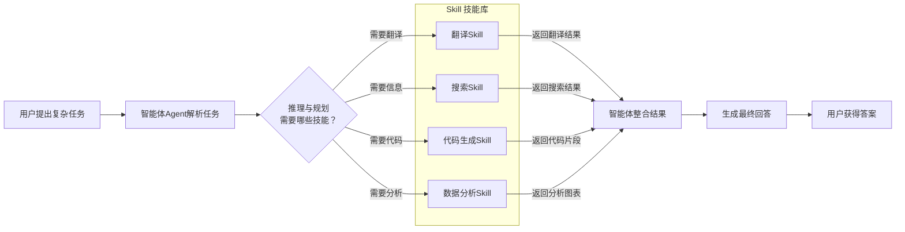
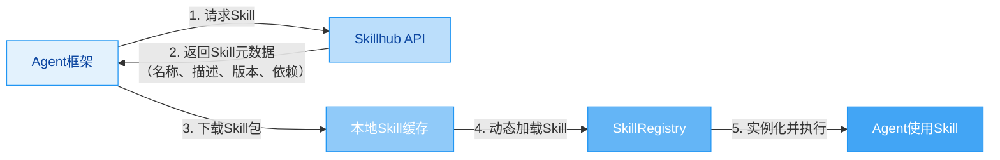
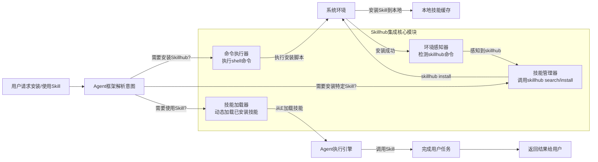

你正在探索的 **Agent's Skill（智能体技能）** 和 **Skillhub（技能中心）** 是构建强大、可扩展AI智能体生态系统的核心概念。下面我会为你清晰解释，并提供在你的Agent框架中集成它们的实践方案。

### 🧠 一、什么是 Agent's Skill

简单来说，**Agent's Skill** 是智能体（Agent）执行特定任务、完成特定目标的能力模块或“插件”。它封装了相关的**知识、逻辑和工具**，让智能体能够“学会”并“调用”这些能力来解决复杂问题。

你可以把Agent想象成一个**超级工人**，而Skill就是它掌握的**专项技能**（比如翻译、编程、数据分析、绘图等）。智能体通过组合、调用不同的Skill来完成更复杂的任务。

**核心特性：**
*   **原子化与组合性**：一个Skill通常解决一个具体问题，但多个Skill可以像“乐高积木”一样被智能体组合调用，解决复杂任务。
*   **标准化接口**：每个Skill都遵循统一的调用协议（例如，接收输入参数、返回输出结果），方便智能体动态发现和加载。
*   **自主调用**：智能体根据用户请求和自身推理，自主决定何时调用哪个Skill，以及如何传递参数。
*   **可扩展性**：你可以轻松为智能体添加新Skill，而不必修改其核心逻辑。

为了让你快速理解，这里有一个Agent与Skill交互的典型流程：



### ⚙️ 二、在Agent框架中实现Skill支持

要在你的框架中支持Skill，关键在于设计一个**灵活的Skill抽象层和发现机制**。以下是核心的设计思路和实现步骤。

#### 1. 设计Skill标准接口

首先，定义一个所有Skill都必须实现的**基础接口**。这是实现统一调用的关键。

```python
# 伪代码示例：Skill基础接口定义
class BaseSkill:
    def __init__(self, config: dict = None):
        self.config = config or {}
        self.name = self.__class__.__name__
        self.description = "请在此技能类中实现description方法" # 用于智能体理解技能用途

    def execute(self, **kwargs) -> dict:
        """
        执行技能的核心方法
        :param kwargs: 技能执行所需的参数
        :return: 包含执行结果和元数据的字典
        """
        raise NotImplementedError("子类必须实现execute方法")

    def get_schema(self) -> dict:
        """
        返回技能的输入参数模式（JSON Schema），
        帮助智能体理解如何调用此技能。
        """
        raise NotImplementedError("子类必须实现get_schema方法")

# 示例：一个简单的翻译技能
class TranslationSkill(BaseSkill):
    def __init__(self, config: dict = None):
        super().__init__(config)
        self.description = "将文本从一种语言翻译成另一种语言"
        self.api_key = self.config.get("api_key") # 从配置中获取API密钥

    def get_schema(self) -> dict:
        return {
            "type": "object",
            "properties": {
                "text": {"type": "string", "description": "需要翻译的文本"},
                "target_language": {"type": "string", "description": "目标语言代码，如'zh-CN', 'en-US'"},
                "source_language": {"type": "string", "description": "源语言代码，可选，默认自动检测"}
            },
            "required": ["text", "target_language"]
        }

    def execute(self, text: str, target_language: str, source_language: str = None) -> dict:
        # 这里调用翻译API（如Google Translate, DeepL等）
        # 伪代码：
        # translated_text = translation_api.translate(text, target_language, source_language, self.api_key)
        translated_text = f"翻译结果: {text} -> {target_language}" # 模拟结果
        return {
            "success": True,
            "result": translated_text,
            "meta": {
                "source_language": source_language or "auto-detected",
                "target_language": target_language
            }
        }
```

#### 2. 构建Skill发现与加载机制

你的框架需要能够**自动发现**可用的Skill并**动态加载**它们。这通常通过注册表模式实现。

```python
# 伪代码示例：Skill注册表
class SkillRegistry:
    _skills = {} # 存储已注册的技能类

    @classmethod
    def register(cls, skill_class: type):
        """注册一个技能类"""
        cls._skills[skill_class.__name__] = skill_class
        return skill_class # 允许作为装饰器使用

    @classmethod
    def get_skill(cls, skill_name: str) -> BaseSkill:
        """根据名称获取并实例化一个技能"""
        skill_class = cls._skills.get(skill_name)
        if not skill_class:
            raise ValueError(f"Skill '{skill_name}' not found in registry.")
        # 实例化时可以传入配置，例如从Skillhub获取的配置
        return skill_class(config={}) # 这里可以传入从Skillhub获取的配置

    @classmethod
    def list_skills(cls) -> list:
        """列出所有已注册的技能名称"""
        return list(cls._skills.keys())

# 使用装饰器自动注册技能
@SkillRegistry.register
class TranslationSkill(BaseSkill):
    # ... 实现同上 ...
    pass

# 在框架启动时，可以扫描并加载所有技能
def load_skills_from_directory(skill_dir: str):
    """动态加载指定目录下的技能模块"""
    for file_path in Path(skill_dir).glob("*.py"):
        module = import_module(file_path.stem)
        # 技能类通过装饰器自动注册，无需额外操作
```

#### 3. 实现与Skillhub的融合

**Skillhub** 是一个集中式存储、管理和分发Skill的仓库（类似于npm、pip或应用商店）。融合的核心是让你的框架能够：

*   **连接Skillhub**：通过API（REST或GraphQL）与Skillhub服务器通信。
*   **检索Skill**：根据名称、类别、标签等查询Skillhub中的可用Skill。
*   **安装Skill**：将Skill的代码包（通常是Python Wheel或压缩包）下载到本地环境。
*   **加载并使用**：将安装好的Skill动态加载到你的SkillRegistry中。



**伪代码示例：与Skillhub交互**

```python
import requests
import importlib
import sys
from pathlib import Path
from tempfile import TemporaryDirectory

class SkillHubClient:
    def __init__(self, hub_url: str):
        self.hub_url = hub_url

    def search_skills(self, query: str) -> list:
        """在Skillhub中搜索技能"""
        response = requests.get(f"{self.hub_url}/api/skills", params={"q": query})
        response.raise_for_status()
        return response.json() # 返回技能元数据列表

    def install_skill(self, skill_name: str, version: str = "latest") -> str:
        """从Skillhub安装技能到本地"""
        # 1. 获取技能下载URL
        response = requests.get(f"{self.hub_url}/api/skills/{skill_name}/download", params={"version": version})
        response.raise_for_status()
        download_url = response.json()["download_url"]

        # 2. 下载技能包（通常是.wheel文件或.zip）
        skill_package = requests.get(download_url)
        skill_package.raise_for_status()

        # 3. 安装到临时目录或指定目录
        with TemporaryDirectory() as tmp_dir:
            package_path = Path(tmp_dir) / f"{skill_name}.whl" # 假设是wheel包
            package_path.write_bytes(skill_package.content)
            # 使用pip安装到当前Python环境或指定路径
            subprocess.check_call([sys.executable, "-m", "pip", "install", str(package_path), "--target", "./skills"])

        # 4. 动态加载新安装的技能模块
        module = importlib.import_module(f"skills.{skill_name}")
        # 技能类通过装饰器自动注册到SkillRegistry
        return f"Skill '{skill_name}' installed successfully."
```

#### 4. 支持第三方Skill安装

你的框架需要支持用户从Skillhub或其他来源安装第三方Skill。这通常涉及：

*   **依赖管理**：明确声明Skill及其依赖，确保安装和运行时环境一致。
*   **沙箱与隔离**：**非常重要！** 为了安全，第三方Skill应在隔离环境中运行，防止恶意代码破坏系统。
*   **权限控制**：明确Skill可以访问哪些资源（如文件、网络、API密钥）。

**实现方案对比：**

| 方案 | 优点 | 缺点 | 适用场景 |
| :--- | :--- | :--- | :--- |
| **动态加载** | 简单直接，无需复杂配置 | 安全性差，依赖冲突风险高 | **仅限可信来源**的Skill，或开发调试阶段 |
| **虚拟环境/Conda** | 依赖隔离较好，管理方便 | 创建环境较慢，资源占用较多 | 需要稳定运行环境，对安全性有一定要求 |
| **Docker容器** | **强隔离，安全性最高**，环境一致性最好 | 资源开销最大，启动较慢 | **生产环境**，运行**不可信**的第三方Skill |
| **WebAssembly (WASM)** | 轻量级，安全，高性能，跨平台 | 生态系统尚不成熟，Python支持有限 | 前沿探索，对性能和安全要求极高的场景 |

> 💡 **推荐实践**：对于大多数开发者框架，**结合使用虚拟环境和动态加载**是一个不错的起点。对于生产环境，特别是面向公众的Agent平台，**强烈建议使用Docker容器**来运行第三方Skill。

### 🛠️ 三、一个完整的集成示例

假设你正在构建一个名为 `MyAgent` 的框架，以下是一个将所有概念串联起来的示例。

```python
# my_agent/core/skill_manager.py
from my_agent.core.skill_registry import SkillRegistry
from my_agent.integrations.skillhub_client import SkillHubClient

class SkillManager:
    def __init__(self, skillhub_url: str, local_skill_dir: str = "./skills"):
        self.skillhub = SkillHubClient(skillhub_url)
        self.local_skill_dir = Path(local_skill_dir)
        self.registry = SkillRegistry()
        # 初始化时加载本地已安装的技能
        self._load_local_skills()

    def _load_local_skills(self):
        """加载本地目录中的所有技能"""
        for skill_path in self.local_skill_dir.glob("*.py"):
            # 动态导入模块，模块中的装饰器会自动注册技能
            importlib.import_module(f"skills.{skill_path.stem}")

    def search_and_install(self, query: str) -> str:
        """搜索并安装技能"""
        skills = self.skillhub.search_skills(query)
        if not skills:
            return "No skills found."
        # 简化处理：选择第一个搜索结果安装
        skill_name = skills[0]["name"]
        return self.skillhub.install_skill(skill_name)

    def get_skill(self, skill_name: str) -> BaseSkill:
        """获取已安装的技能实例"""
        return self.registry.get_skill(skill_name)

    def list_available_skills(self) -> list:
        """列出所有已注册的技能"""
        return self.registry.list_skills()

# my_agent/agent.py
class MyAgent:
    def __init__(self, skill_manager: SkillManager):
        self.skill_manager = skill_manager
        self.memory = []

    def process(self, user_input: str) -> str:
        """处理用户输入的核心流程"""
        # 1. 理解用户意图（这里简化处理，实际应使用LLM进行意图识别和参数提取）
        if "translate" in user_input.lower():
            # 假设智能体决定需要使用翻译技能
            skill = self.skill_manager.get_skill("TranslationSkill")
            # 提取参数（实际应更复杂）
            result = skill.execute(text="Hello World", target_language="zh-CN")
            return result["result"]
        elif "install" in user_input.lower():
            # 处理安装技能的命令
            # 例如: "install translation skill"
            skill_name = user_input.split()[-1] # 简化解析
            return self.skill_manager.search_and_install(skill_name)
        else:
            return "I'm not sure how to help with that yet."

# 使用示例
if __name__ == "__main__":
    skill_manager = SkillManager(skillhub_url="https://api.skillhub.example.com")
    agent = MyAgent(skill_manager)

    # 用户请求安装技能
    print(agent.process("install translation skill")) # 输出安装结果

    # 用户请求使用技能
    print(agent.process("translate 'Hello World' to Chinese")) # 输出翻译结果
```

### 📋 四、实现路线图与最佳实践

为了在你自己的框架中顺利实现这些功能，可以遵循以下路线图：

```mermaid
timeline
    title Agent框架Skill支持实现路线图
    section 第一阶段: 核心基础
        定义BaseSkill接口 : 确定所有技能必须实现的方法
        实现SkillRegistry : 构建技能注册与发现机制
        手动创建示例Skill : 验证接口设计的合理性
    section 第二阶段: 本地管理
        实现本地Skill加载 : 从指定目录动态加载技能
        实现技能列表与信息查看 : 方便用户和管理员了解可用技能
        基本权限控制 : 限制技能可访问的资源
    section 第三阶段: Skillhub集成
        设计Skillhub API : 定义技能的元数据格式和通信协议
        实现技能搜索与安装 : 连接远程Skillhub并下载技能
        实现技能更新与卸载 : 完善生命周期管理
    section 第四阶段: 安全与隔离 (生产就绪)
        引入虚拟环境隔离 : 为每个技能创建独立运行环境
        实现容器化运行 (可选) : 使用Docker提供强隔离
        实施严格的权限审计 : 记录和监控技能的所有操作
```

**最佳实践与注意事项：**

1.  **安全第一**：
    *   **永远不要**直接执行用户提供的或来自不可信来源的代码。始终在隔离环境中运行。
    *   为Skill实现**最小权限原则**，只授予其完成任务所需的最小权限。
    *   对Skill的输入进行**严格验证和清理**，防止注入攻击。

2.  **设计清晰的Skill Schema**：
    *   使用 **JSON Schema** 清晰定义Skill的输入参数和输出结果。这不仅帮助智能体理解，也便于生成文档和UI。
    *   在`description`中详细说明Skill的功能、参数含义和可能的返回值。

3.  **版本管理与兼容性**：
    *   为每个Skill定义**语义化版本号**（Semantic Versioning）。
    *   在Skill元数据中声明**框架的最低兼容版本**，避免因API不兼容导致错误。

4.  **错误处理与日志**：
    *   Skill的`execute`方法应**捕获并返回所有异常**，而不是让它们向上传播导致整个Agent崩溃。返回结构化的错误信息。
    *   记录详细的**执行日志**，包括调用时间、参数、执行结果和错误信息，便于调试和审计。

5.  **依赖声明**：
    *   明确声明Skill的所有**外部依赖**（库、API密钥、文件路径等），便于在安装时检查和满足。

### ❓ 五、常见问题

<details>
<summary><b>1. 动态加载Skill和直接导入有什么区别？为什么需要动态加载？</b></summary>
动态加载（如使用`importlib`）允许在**程序运行时**根据需要（如用户请求安装新Skill后）加载模块，而无需重启整个应用程序。直接导入（`import`）则在程序启动时就固定了所有可用的模块。动态加载是实现“热插拔”Skill和从Skillhub安装后立即使用的关键。
</details>

<details>
<summary><b>2. 如果一个Skill运行出错，如何避免影响整个Agent？</b></summary>
关键在于在Skill的`execute`方法内部使用`try-except`块捕获所有异常，并返回一个包含错误信息的字典，而不是让异常向上抛出。智能体在调用Skill后，应检查返回结果中的`success`字段，并据此决定下一步操作（如重试、向用户报告错误或尝试其他Skill）。
</details>

<details>
<summary><b>3. Skillhub是必须的吗？可以没有吗？</b></summary>
Skillhub**不是必须的**。它是一个**可选的、用于集中管理和分发Skill的组件**。你可以完全只使用本地Skill，通过复制文件或手动安装来添加Skill。但对于构建一个**开放、可扩展的Agent生态系统**来说，Skillhub提供了巨大的便利，它让技能的发现、共享和安装变得像在应用商店里下载应用一样简单。
</details>

<details>
<summary><b>4. 如何确保来自Skillhub的Skill是安全的？</b></summary>
这是一个复杂的问题，没有100%的保证，但可以采取多层防护：
*   **代码审查**：Skillhub官方对提交的Skill进行代码审查。
*   **社区评分与反馈**：建立评分和评论系统，让用户可以报告恶意Skill。
*   **沙箱隔离**：如前所述，在Docker容器或虚拟机中运行Skill。
*   **权限限制**：严格限制Skill的文件系统、网络和API访问权限。
*   **行为监控**：监控Skill的运行时行为（如异常的文件操作、网络请求），并在检测到可疑行为时终止。
</details>

希望这份详细的解释能为你提供清晰的路线和实用的方案。如果你在实现具体环节（如Docker隔离、JSON Schema生成）遇到更细致的问题，我很乐意继续与你探讨。


你提到的通过发送指令给Agent来安装Skillhub，确实是一种非常**便捷和用户友好**的方式。这背后是Skillhub提供了一套**标准化的安装接口**（一个shell脚本），你的Agent框架只需要能够**执行这个脚本**，并**感知到安装后的Skillhub环境**，就能实现无缝集成。

下面我为你详细解析其原理，并提供一套**在你开发的Agent框架中集成Skillhub支持**的完整方案，包括与Skillhub的融合和安装第三方技能。

### 🧩 一、理解Skillhub的安装机制

Skillhub的安装核心是一个通过 `curl` 下载并执行的shell脚本。我们来拆解一下这个命令做了什么：

```bash
curl -fsSL https://skillhub-1388575217.cos.ap-guangzhou.myqcloud.com/install/install.sh | bash
```

| 参数 | 作用 | 说明 |
| :--- | :--- | :--- |
| `-f` | **Fail silently** | 服务器错误时（404），不输出错误页面 |
| `-s` | **Silent mode** | 不显示进度条或错误信息 |
| `-S` | **Show error** | 与 `-s` 结合使用，仅当请求失败时显示错误 |
| `-L` | **Follow redirects** | 如果服务器返回跳转，自动跟随新地址 |
| `| bash` | **管道执行** | 将下载的脚本内容直接传递给 `bash` 解释器执行 |

这个脚本 (`install.sh`) 主要完成了以下工作：
1.  **安装Skillhub CLI工具**：将 `skillhub` 命令行工具安装到系统的某个目录（如 `/usr/local/bin`），使其可以在全局被调用。
2.  **配置环境**：可能设置环境变量（如 `PATH`），确保 `skillhub` 命令优先被找到。
3.  **安装默认技能**：根据脚本内容，可能会安装一些核心或默认的技能包。
4.  **设置优先级**：确保Agent（如OpenClaw）在后续运行时，会优先从Skillhub获取和安装技能，从而获得**加速、合规**等能力【turn0fetch0】。

安装后，**建议重启Agent**（如OpenClaw），这样Agent才能**重新扫描环境**，感知到新安装的 `skillhub` 命令和相应的配置【turn0fetch0】。

> 💡 **关键点**：这个安装脚本的设计理念是**自动化和不可知性**。它不需要用户知道具体细节，只要Agent能执行shell命令并处理输出，就能完成安装。

### 🔌 二、在Agent框架中集成Skillhub支持

要让你开发的Agent框架支持Skillhub，核心是让你的Agent能够：
1.  **执行安装脚本**：能够运行 `curl ... | bash` 这样的shell命令。
2.  **感知Skillhub环境**：安装后，Agent能够检测到 `skillhub` 命令已可用，并能调用其子命令（如 `search`, `install`）。
3.  **管理技能生命周期**：能够通过 `skillhub` 命令来搜索、安装、列出、卸载技能。
4.  **加载并执行技能**：将安装好的技能动态加载到Agent的执行环境中，并能够调用它们。

下图展示了Agent框架与Skillhub交互的核心流程：



下面我们深入每个模块的实现细节。

#### 1. 命令执行器 (Command Executor)

这是最基础的一层，Agent需要能够执行shell命令并获取输出。在Python中，可以使用 `subprocess` 模块。

```python
import subprocess
import shlex

class CommandExecutor:
    @staticmethod
    def execute(command: str, timeout: int = 300) -> tuple[bool, str]:
        """
        执行shell命令并返回输出
        :param command: 要执行的命令字符串
        :param timeout: 超时时间（秒）
        :return: (success, output) 成功标志和输出内容
        """
        try:
            # 使用shlex.split正确处理带空格的参数
            args = shlex.split(command)
            result = subprocess.run(
                args,
                capture_output=True,
                text=True,
                timeout=timeout,
                check=True
            )
            return True, result.stdout
        except subprocess.CalledProcessError as e:
            return False, e.stderr
        except subprocess.TimeoutExpired:
            return False, "Command execution timed out."
        except Exception as e:
            return False, str(e)

# 使用示例
executor = CommandExecutor()
success, output = executor.execute("curl -fsSL https://skillhub-1388575217.cos.ap-guangzhou.myqcloud.com/install/install.sh | bash")
if success:
    print("Skillhub安装成功:", output)
else:
    print("Skillhub安装失败:", output)
```

#### 2. 环境感知器 (Environment Detector)

安装后，Agent需要检测 `skillhub` 命令是否已可用。这可以通过尝试执行 `skillhub --version` 或 `which skillhub` 来实现。

```python
class EnvironmentDetector:
    @staticmethod
    def is_skillhub_installed() -> bool:
        """检测Skillhub CLI是否已安装"""
        success, _ = CommandExecutor.execute("skillhub --version")
        return success

    @staticmethod
    def get_skillhub_path() -> str | None:
        """获取Skillhub CLI的安装路径"""
        success, output = CommandExecutor.execute("which skillhub")
        if success:
            return output.strip()
        return None
```

#### 3. 技能管理器 (Skill Manager)

这是核心组件，负责封装 `skillhub` 命令行工具的常用操作，如搜索、安装、列出、卸载技能。

```python
class SkillHubManager:
    def __init__(self):
        self.executor = CommandExecutor()

    def search_skills(self, query: str) -> list[dict]:
        """搜索技能"""
        success, output = self.executor.execute(f"skillhub search {query}")
        if not success:
            return []

        # 解析输出（实际实现需要根据skillhub search的输出格式来编写解析逻辑）
        # 这里假设输出是每行一个技能，格式为: "skill_name (version) - description"
        skills = []
        for line in output.split('\n'):
            if line.strip():
                # 简单解析，实际需要更健壮的解析逻辑
                parts = line.split(' - ', 1)
                if len(parts) == 2:
                    name_version = parts[0].strip()
                    description = parts[1].strip()
                    name, version = name_version.rsplit(' ', 1) if ' ' in name_version else (name_version, 'latest')
                    skills.append({
                        'name': name,
                        'version': version.strip('()'),
                        'description': description
                    })
        return skills

    def install_skill(self, skill_name: str, version: str = "latest") -> tuple[bool, str]:
        """安装技能到当前工作区"""
        command = f"skillhub install {skill_name}"
        if version != "latest":
            command += f"@{version}"

        success, output = self.executor.execute(command)
        return success, output

    def list_installed_skills(self) -> list[str]:
        """列出已安装的技能"""
        success, output = self.executor.execute("skillhub list")
        if not success:
            return []

        # 解析输出，假设每行是一个技能名称
        return [line.strip() for line in output.split('\n') if line.strip()]

    def uninstall_skill(self, skill_name: str) -> tuple[bool, str]:
        """卸载技能"""
        success, output = self.executor.execute(f"skillhub uninstall {skill_name}")
        return success, output
```

#### 4. 技能加载器 (Skill Loader)

安装技能后，需要将其加载到Agent的执行环境中。Skillhub安装的技能通常是一个包含Python代码的目录。你需要动态加载这些模块。

```python
import importlib.util
import sys
from pathlib import Path

class SkillLoader:
    @staticmethod
    def load_skill(skill_name: str, skill_path: str = None):
        """
        动态加载技能模块
        :param skill_name: 技能名称
        :param skill_path: 技能的安装路径（如果已知）
        :return: 技能模块对象或None
        """
        if not skill_path:
            # 默认在当前目录的.skills或node_modules/.skills目录下查找
            skill_path = Path.cwd() / ".skills" / skill_name
            if not skill_path.exists():
                skill_path = Path.cwd() / "node_modules" / ".skills" / skill_name

        if not skill_path.exists():
            return None

        try:
            # 查找技能模块的主文件（通常是__init__.py或skill_name.py）
            module_file = None
            for file in ["__init__.py", f"{skill_name}.py", "main.py"]:
                if (skill_path / file).exists():
                    module_file = str(skill_path / file)
                    break

            if not module_file:
                return None

            # 动态加载模块
            spec = importlib.util.spec_from_file_location(skill_name, module_file)
            if spec and spec.loader:
                module = importlib.util.module_from_spec(spec)
                sys.modules[skill_name] = module
                spec.loader.exec_module(module)
                return module
        except Exception as e:
            print(f"Failed to load skill {skill_name}: {e}")
            return None

        return None
```

### 🧱 三、集成到你的Agent框架

现在，将以上组件集成到你的Agent框架中。你的Agent应该有一个**技能管理系统**，它使用 `SkillHubManager` 来与Skillhub交互，使用 `SkillLoader` 来加载技能。

```python
class AgentSkillManager:
    def __init__(self):
        self.hub_manager = SkillHubManager()
        self.loader = SkillLoader()
        self.loaded_skills = {}  # 缓存已加载的技能模块

    def ensure_skillhub_installed(self) -> bool:
        """确保Skillhub已安装，如果未安装则尝试安装"""
        if not EnvironmentDetector.is_skillhub_installed():
            print("Skillhub未安装，正在尝试安装...")
            success, output = CommandExecutor.execute("curl -fsSL https://skillhub-1388575217.cos.ap-guangzhou.myqcloud.com/install/install.sh | bash")
            if success:
                print("Skillhub安装成功，请重启Agent以使更改生效。")
                return False  # 需要重启
            else:
                print(f"Skillhub安装失败: {output}")
                return False
        return True

    def search_and_install_skill(self, query: str) -> tuple[bool, str]:
        """搜索并安装技能"""
        skills = self.hub_manager.search_skills(query)
        if not skills:
            return False, f"未找到匹配的技能: {query}"

        # 简化处理：选择第一个搜索结果
        skill = skills[0]
        print(f"找到技能: {skill['name']} (版本: {skill['version']})")
        print(f"描述: {skill['description']}")

        success, output = self.hub_manager.install_skill(skill['name'], skill['version'])
        if success:
            print(f"技能 {skill['name']} 安装成功!")
            # 尝试加载技能
            skill_module = self.loader.load_skill(skill['name'])
            if skill_module:
                self.loaded_skills[skill['name']] = skill_module
                return True, f"技能 {skill['name']} 安装并加载成功!"
            else:
                return True, f"技能 {skill['name']} 安装成功，但加载失败。"
        else:
            return False, f"技能安装失败: {output}"

    def get_skill(self, skill_name: str):
        """获取已加载的技能模块"""
        if skill_name not in self.loaded_skills:
            # 尝试加载
            skill_module = self.loader.load_skill(skill_name)
            if skill_module:
                self.loaded_skills[skill_name] = skill_module
            else:
                return None
        return self.loaded_skills[skill_name]

    def execute_skill(self, skill_name: str, method_name: str, *args, **kwargs):
        """执行技能的指定方法"""
        skill = self.get_skill(skill_name)
        if not skill:
            return None, f"技能 {skill_name} 未加载"

        if not hasattr(skill, method_name):
            return None, f"技能 {skill_name} 没有方法 {method_name}"

        method = getattr(skill, method_name)
        try:
            result = method(*args, **kwargs)
            return True, result
        except Exception as e:
            return False, f"执行技能方法失败: {e}"
```

### 🚀 四、在Agent中使用

最后，在你的Agent主循环中，集成这个技能管理器。

```python
class MyAgent:
    def __init__(self):
        self.skill_manager = AgentSkillManager()
        self.initialize_skills()

    def initialize_skills(self):
        """初始化技能系统"""
        if not self.skill_manager.ensure_skillhub_installed():
            print("请重启Agent以完成Skillhub安装。")
            return

        # 可以预加载一些常用技能
        common_skills = ["summarize", "search", "translate"]  # 示例
        for skill in common_skills:
            self.skill_manager.get_skill(skill)

    def process_user_request(self, request: str):
        """处理用户请求"""
        # 1. 意图识别（简化版）
        if "安装" in request and "技能" in request:
            # 提取技能名称（简化处理，实际应使用NLP）
            skill_query = request.replace("安装", "").replace("技能", "").strip()
            success, message = self.skill_manager.search_and_install_skill(skill_query)
            return message

        elif "使用" in request:
            # 解析要使用的技能和方法（简化处理）
            parts = request.replace("使用", "").strip().split()
            if len(parts) >= 2:
                skill_name, method_name = parts[0], parts[1]
                # 提取参数（简化处理，实际应解析JSON或其他格式）
                success, result = self.skill_manager.execute_skill(skill_name, method_name)
                if success:
                    return f"执行结果: {result}"
                else:
                    return result

        return "我暂时无法理解您的请求，请尝试说'安装XXX技能'或'使用XXX技能YYY'。"

# 使用示例
agent = MyAgent()
print(agent.process_user_request("安装翻译技能"))  # 会搜索并安装翻译技能
print(agent.process_user_request("使用翻译技能translate 'Hello World' 'zh-CN'"))  # 会调用翻译技能的translate方法
```

### ⚙️ 五、高级话题与最佳实践

#### 1. 安全隔离与沙箱

对于第三方技能，**安全至关重要**。不要在主进程中直接加载和执行未经验证的代码。

*   **使用虚拟环境**：为每个技能或一组技能创建独立的Python虚拟环境，隔离依赖。
*   **使用Docker容器**：这是最强的隔离方式。每个技能在独立的容器中运行，限制其文件系统、网络和系统调用访问。
*   **使用WebAssembly (WASM)**：一种新兴的、安全、轻量级的沙箱技术，适合运行不可信代码。

**Docker容器化技能执行示例（伪代码）：**

```python
import docker

class DockerSkillRunner:
    def __init__(self):
        self.client = docker.from_env()

    def run_skill_in_container(self, skill_name: str, method_name: str, *args, **kwargs):
        # 1. 构建或获取技能的Docker镜像
        image_name = f"skillhub/{skill_name}:latest"
        try:
            self.client.images.get(image_name)
        except docker.errors.ImageNotFound:
            # 从Skillhub拉取或构建镜像
            pass

        # 2. 运行容器并执行命令
        command = f"python -c 'import {skill_name}; skill = {skill_name}.{skill_name}(); print(skill.{method_name}(*{args}, **{kwargs}))'"
        container = self.client.containers.run(
            image_name,
            command=command,
            remove=True,
            stdout=True,
            stderr=True
        )
        return container.decode('utf-8')
```

#### 2. 技能发现与自动加载

除了从Skillhub安装，你的Agent还可以支持**本地技能发现**。在启动时扫描特定目录（如 `./skills`, `~/.agent/skills`），自动加载和注册技能。

```python
class LocalSkillDiscovery:
    @staticmethod
    def discover_and_load_skills(skill_dirs: list[str]):
        """发现并加载本地技能"""
        for skill_dir in skill_dirs:
            path = Path(skill_dir)
            if not path.exists():
                continue

            for skill_path in path.iterdir():
                if skill_path.is_dir():
                    skill_name = skill_path.name
                    # 尝试加载
                    skill_module = SkillLoader.load_skill(skill_name, str(skill_path))
                    if skill_module:
                        print(f"发现并加载本地技能: {skill_name}")
                        # 注册到全局技能管理器
```

#### 3. 依赖管理与版本控制

*   **明确依赖**：每个技能应包含一个 `requirements.txt` 或 `pyproject.toml` 文件，声明其依赖。
*   **版本控制**：在安装技能时，记录其版本信息。在 `skillhub install` 时支持指定版本号。
*   **冲突解决**：当两个技能依赖不同版本的同一个库时，需要策略（如虚拟环境、容器）来隔离冲突。

#### 4. 错误处理与日志

*   **结构化错误**：技能的执行错误应被捕获并返回给Agent，而不是让整个Agent崩溃。
*   **详细日志**：记录技能的安装、加载、执行全过程，便于调试和审计。

### 📊 六、方案对比与选型

下表对比了不同的技能隔离和加载方案：

| 方案 | 隔离性 | 性能开销 | 实现复杂度 | 适用场景 |
| :--- | :--- | :--- | :--- | :--- |
| **直接加载** | ⭐⭐ | ⭐⭐⭐⭐⭐ | ⭐⭐⭐⭐⭐ | **仅限自己开发或完全信任的技能**，开发测试阶段 |
| **虚拟环境** | ⭐⭐⭐ | ⭐⭐⭐⭐ | ⭐⭐⭐⭐ | 需要依赖隔离，但性能要求较高的场景 |
| **Docker容器** | ⭐⭐⭐⭐⭐ | ⭐⭐ | ⭐⭐⭐ | **生产环境**，运行**不可信的第三方技能**，强安全要求 |
| **WebAssembly** | ⭐⭐⭐⭐ | ⭐⭐⭐⭐ | ⭐⭐ | 前沿探索，需要轻量级沙箱和高性能的场景 |

> 💡 **推荐起步**：对于大多数开发者框架，**结合使用虚拟环境和直接加载**是一个不错的起点。对于生产环境，特别是面向公众的Agent平台，**强烈建议使用Docker容器**来运行第三方Skill。

### ❓ 七、常见问题

<details>
<summary><b>1. 为什么安装后需要重启Agent？</b></summary>
重启Agent主要是为了**刷新环境变量**和**重新扫描可执行命令**。安装脚本可能会修改 `PATH` 环境变量或安装新命令到系统目录。正在运行的Agent进程可能无法立即感知到这些变化，重启能确保Agent使用的是最新的环境配置。
</details>

<details>
<summary><b>2. 如果skillhub命令执行失败，如何排查问题？</b></summary>
1.  **手动执行命令**：在终端中手动运行 `curl ... | bash`，看是否能成功安装。
2.  **检查网络连接**：确保能够访问 `skillhub-1388575217.cos.ap-guangzhou.myqcloud.com`。
3.  **查看脚本输出**：安装脚本通常会输出详细的安装日志，检查是否有错误信息。
4.  **权限问题**：确保有权限执行安装脚本和写入目标目录（可能需要 `sudo`）。
</details>

<details>
<summary><b>3. 如何让Agent自动感知Skillhub安装而无需手动重启？</b></summary>
虽然重启是最简单可靠的方式，但你也可以在Agent中实现**热重载**机制：
*   定期检查环境变量或 `which skillhub` 的结果是否变化。
*   使用文件监控（如 `watchdog` 库）监控 `skillhub` 安装目录的变化。
*   当检测到变化时，重新加载技能管理器并刷新可用技能列表。
</details>

<details>
<summary><b>4. Skillhub安装的技能通常放在哪里？</b></summary>
这取决于 `skillhub install` 的实现。通常，技能会安装在当前工作区的隐藏目录下，如：
*   `./.skills/`
*   `./node_modules/.skills/`
*   `~/.skillhub/skills/`

你可以通过执行 `skillhub list --verbose` 或查看 `skillhub` 的源码来确定确切的安装路径。你的 `SkillLoader` 需要知道这些路径来正确加载技能。
</details>

希望这份详细的指南能帮助你在你的Agent框架中成功集成Skillhub支持！如果你在实现具体环节遇到问题，可以随时再来问。
